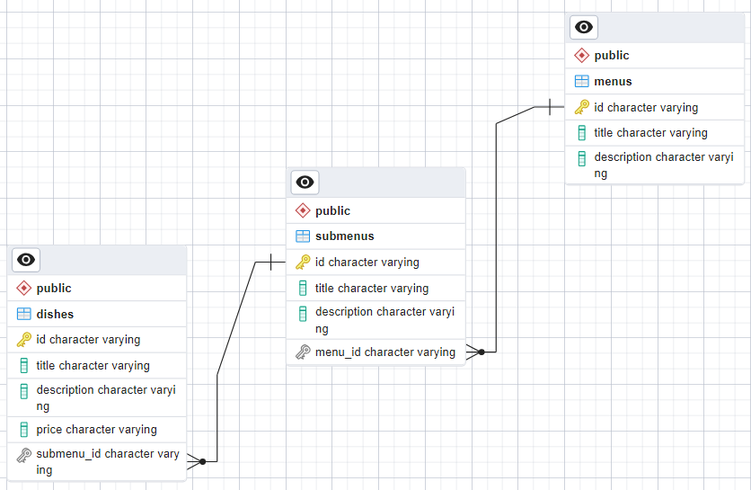

# REST API для работы с меню ресторана


### Описание проекта

Этот проект представляет собой REST API для работы с меню ресторана.
Стек проекта: FastAPI, PostgreSQL, Redis, Celery, RabbitMQ, Docker.

**Схема БД:**



<details>
<summary><b>ЗАДАНИЯ:</b></summary>

1. Написать проект на FastAPI с использованием PostgreSQL в качестве БД.
   В проекте следует реализовать REST API по работе с меню ресторана, все CRUD операции. Даны 3 сущности: Меню, Подменю,
   Блюдо.

   Зависимости:
    - У меню есть подменю, которые к ней привязаны.
    - У подменю есть блюда.

   Условия:
    - Блюдо не может быть привязано напрямую к меню, минуя подменю.
    - Блюдо не может находиться в 2-х подменю одновременно.
    - Подменю не может находиться в 2-х меню одновременно.
    - Если удалить меню, должны удалиться все подменю и блюда этого меню.
    - Если удалить подменю, должны удалиться все блюда этого подменю.
    - Цены блюд выводить с округлением до 2 знаков после запятой.
    - Во время выдачи списка меню, для каждого меню добавлять кол-во подменю и блюд в этом меню.
    - Во время выдачи списка подменю, для каждого подменю добавлять кол-во блюд в этом подменю.

2. В этом домашнем задании необходимо:

   Обернуть программные компоненты в контейнеры. Контейнеры должны запускаться по одной команде “docker-compose up -d”
   или той которая описана вами в readme.md.

   Образы для Docker:
    - (API) python:3.10-slim
    - (DB) postgres:15.1-alpine

    - Написать CRUD тесты для ранее разработанного API с помощью библиотеки pytest
    - Подготовить отдельный контейнер для запуска тестов. Команду для запуска указать в README.md

3. В этом домашнем задании необходимо:

    - Вынести бизнес логику и запросы в БД в отдельные слои приложения.
    - Добавить кэширование запросов к API с использованием Redis. Не забыть про инвалидацию кэша.
    - Добавить pre-commit хуки в проект.
    - Покрыть проект type hints (тайпхинтами)
    - Описать ручки API в соответствий c OpenAPI
    - Реализовать в тестах аналог Django reverse() для FastAPI

   Дополнительно:

    - Контейнеры с проектом и с тестами запускаются разными командами.

4. В этом домашнем задании необходимо:

    - Переписать текущее FastAPI приложение на асинхронное выполнение
    - Добавить в проект фоновую задачу с помощью Celery + RabbitMQ.
    - Добавить эндпоинт (GET) для вывода всех меню со всеми связанными подменю и со всеми связанными блюдами.
    - Реализовать инвалидацию кэша в background task

   Фоновая задача:
   Синхронизация Excel документа и БД. В проекте создаем папку admin. В эту папку кладем файл Menu.xlsx (будет
   прикреплен к ДЗ). При внесении изменений в файл все изменения должны отображаться в БД. Периодичность обновления 15
   сек. Удалять БД при каждом обновлении – нельзя.

</details>

### Установка и запуск проекта через Docker

1. Убедитесь, что у вас установлен Python версии 3.7 или выше.
2. Клонируйте репозиторий с GitHub: `git clone https://github.com/dellream/REST-API-app_test_task.git`
3. Запустите проект с помощью docker-compose:

```
docker-compose up -d
```

4. Документация будет доступна по адресу http://127.0.0.1:8000/docs

### Завершение работы

Эта команда остановит и удалит все контейнеры, тома и образы, связанные с вашим проектом в текущей директории:

```
docker-compose down -v --rmi all
```

### Тестирование с помощью pytest

Проект частично покрыт тестами, все эндпоинты покрыты тестами (в т.ч. эндпоинт по древовидной структуре меню).
Запустите тесты с помощью следующей команды (после завершения тестов, контейнеры будут остановлены, но не удалены):

```
docker-compose -f docker-compose-pytest.yml up -d && docker logs --follow backend && docker compose -f docker-compose-pytest.yml down -v
```

### Запуск приложения на локальной машине (windows 10)

1. Убедитесь, что у вас установлен Python версии 3.7 или выше.
2. Клонируйте репозиторий с GitHub: `git clone https://github.com/dellream/REST-API-app_test_task.git`
3. Установите все зависимости командой `pip install -r requirements.txt`
4. Для запуска на локальной машине необходимо закомментировать все строки с меткой "Docker" в app/config.py и
   раскомментировать все строки с меткой "Локальный"
5. Установите Redis, для windows проще всего скачать архив: https://github.com/tporadowski/redis/releases
6. Из архива запустите redis-server.exe (для работы с кешем можно использовать redis-cli из архива)
7. Установите RabbitMQ, предварительно установив Erlang
8. Запустите RabbitMQ Command Prompt и выполните команду `rabbitmq-server`. После того как брокер запущен,
   вы сможете использовать веб-интерфейс управления RabbitMQ, перейдя по адресу http://localhost:15672/ в веб-браузере
   и войдя с учетными данными guest/guest (если вы не изменили их настройки аутентификации).
9. В терминале вашего IDE запустите работу Celery
   командой `celery -A app.tasks.tasks:celery worker --loglevel=INFO --pool=solo`
10. Во втором терминале запустите FastApi приложение командой `uvicorn app.main:app --reload`. Документация будет
    доступна по адресу http://127.0.0.1:8000/docs

При запуске на локальной машине с запуском фоновой задачи меню будет сформировано на основе excel-таблицы (задание №4).
Каждые 15 секунд происходит проверка на изменения Menu.xlsx, таким образом данные в БД всегда будут соответствовать таблице
Menu.xlsx.

### Схема кеширования запросов

- Одной из важных и больших задач было кеширование всех запросов с помощью Redis.
- Поскольку требовалось учитывать инвалидацию кеша, то было принято решение **не** использовать
существующие библиотеки, такие как fastapi-cache, а разработать собственную логику кеширования.
- В Redis в качестве ключей записывается путь в формате '/menus/{menu_id}/submenus/{submenu_id}/dishes/{dish_id}',
а в качестве значений выступают данные для конкретных запросов в формате pickle (подробнее можно посмотреть в app/db/cache.py)
- Благодаря тщательно продуманной схеме кеширования, данные всегда остаются актуальными, и устаревший кеш автоматически удаляется.

### Тестирование с помощью POSTMAN

Тесты в POSTMAN рассчитаны на пустую базу данных.
В репозитории есть директория "postman", где находятся файлы с форматом .json для POSTMAN

<details>
<summary><b>Инструкция по работе с POSTMAN:</b></summary>


1. Нажимаем import (1) и переносим два файла (*menu app.postman_collection.json* и *menu app.postman_environment.json*) в окно Postman. Один файл - коллекция тестов, второй - переменные окружения.<br>
2. В диалоговом окне подтверждаем импорт. После этого должна появиться коллекция (подчеркнута на скриншоте) menu app.
Выбираем переменные окружения (2) из выпадающего списка
3. После этого можем зайти в коллекцию menu app и запустить каждый тест вручную. Для этого открываем коллекцию menu app,
выбираем Тестовый сценарий -> CRUD для меню -> Просматривает список меню (или любой другой).
4. Если хотим запустить сразу всю коллекцию тестов, то жмем на три точки (3) рядом с коллекцией и выбираем
Run.</sub>
</details>

## Контакты

**telegram:** [@dellream](https://t.me/dellream)
**e-mail:** yakimov.as@mail.ru
